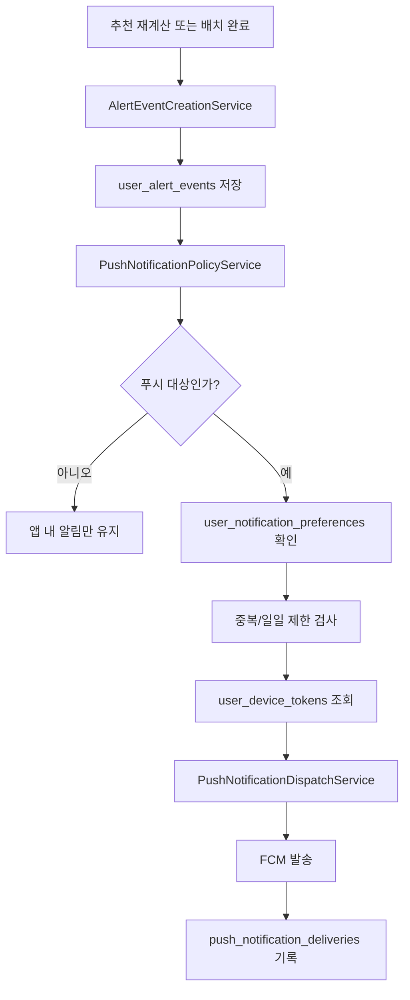
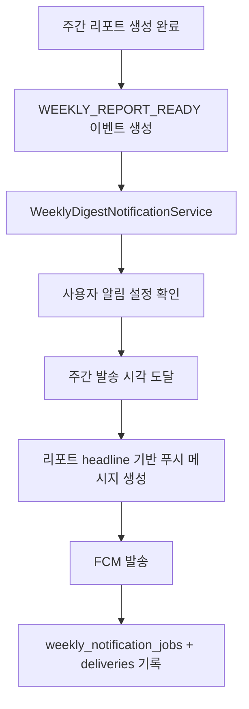

# MaeMoJi 푸시 알림 아키텍처 초안

## 목표

MaeMoJi의 앱 내 알림(`user_alert_events`)을
실제 디바이스 푸시 알림과 자연스럽게 연결한다.

핵심 원칙은 아래 4가지다.

1. 중요한 변화만 푸시로 보낸다
2. 나머지는 앱 내 알림함에서 소비한다
3. 읽음 상태는 서버가 진실의 원본이다
4. 즉시 알림과 주간 묶음 알림을 분리한다

---

## 1. 채널 전략

MaeMoJi는 아래 3개 채널을 동시에 가진다.

### 1.1 앱 내 알림

- 현재 `user_alert_events` 기반
- 모든 알림 이벤트의 원본 저장소
- 홈/설정/알림 목록 화면에서 조회

### 1.2 푸시 알림

- 1차 표준 채널
- `Firebase Cloud Messaging (FCM)` 기준
- Android 우선 적용
- iOS는 추후 APNs + Firebase 연동 확장

### 1.3 로컬 알림

- 보조 채널
- 서버 푸시가 아닌 클라이언트 예약 알림
- 주간 리포트 리마인드, 사용자가 직접 켠 리마인드에 적합
- 서버 기준 이벤트 전달 채널의 기본은 아님

한 줄 결론:

- 강한 변화 알림 = FCM 푸시
- 주간 리포트 리마인드 = 로컬 알림 또는 주간 묶음 푸시
- 앱 내 알림함 = 항상 유지

---

## 2. 알림 정책 enum / 분류표

## 2.1 내부 이벤트 enum

| 이벤트 코드 | 의미 | 앱 내 저장 | 푸시 발송 | 기본 우선순위 |
|---|---|---:|---:|---|
| `STATUS_CHANGED` | 추천 상태가 실제로 바뀜 | Y | Y | HIGH |
| `NEWS_WEAKENED` | 뉴스 분위기 악화 | Y | Y | HIGH |
| `PRICE_RISK` | 가격 흐름/안정성 악화 | Y | Y | HIGH |
| `WEEKLY_REPORT_READY` | 주간 리포트 생성 완료 | Y | Y | NORMAL |
| `PRICE_IMPROVED` | 가격 흐름 안정 | Y | N | LOW |
| `FUNDAMENTAL_IMPROVED` | 기업 체력 개선 반영 | Y | N | LOW |
| `STABLE_REVIEW` | 큰 방향 변화는 없지만 다시 확인 | Y | N | LOW |
| `CAUTIOUS_MAINTAIN` | 보수적 유지 | Y | N | LOW |
| `NEW_ENTRY` | 새 분석 또는 신규 종목 포함 | Y | N | LOW |

## 2.2 사용자 노출 라벨

| 이벤트 코드 | 사용자 라벨 | 추천 채널 |
|---|---|---|
| `STATUS_CHANGED` | 의견 변경 | 즉시 푸시 + 앱 내 |
| `NEWS_WEAKENED` | 뉴스 악화 | 즉시 푸시 + 앱 내 |
| `PRICE_RISK` | 가격 흔들림 | 즉시 푸시 + 앱 내 |
| `WEEKLY_REPORT_READY` | 이번 주 리포트 | 주간 묶음 푸시 + 앱 내 |
| `PRICE_IMPROVED` | 가격 안정 | 앱 내만 |
| `FUNDAMENTAL_IMPROVED` | 기업 체력 개선 | 앱 내만 |
| `STABLE_REVIEW` | 다시 확인 | 앱 내만 |
| `CAUTIOUS_MAINTAIN` | 보수적 유지 | 앱 내만 |
| `NEW_ENTRY` | 새 분석 | 앱 내만 |

## 2.3 운영 정책

즉시 푸시 허용 대상

- `STATUS_CHANGED`
- `NEWS_WEAKENED`
- `PRICE_RISK`

주간 묶음 푸시 대상

- `WEEKLY_REPORT_READY`

푸시 제외 대상

- `PRICE_IMPROVED`
- `FUNDAMENTAL_IMPROVED`
- `STABLE_REVIEW`
- `CAUTIOUS_MAINTAIN`
- `NEW_ENTRY`

---

## 3. 즉시 알림 vs 주간 묶음 알림

## 3.1 즉시 알림

조건:

- 추천 상태 실제 변경
- 뉴스 악화
- 가격 리스크 진입

원칙:

- 하루 최대 2건
- 같은 종목 + 같은 사유는 24시간 중복 발송 금지
- 같은 시점에 여러 이벤트가 겹치면 우선순위 1건만 발송

우선순위:

1. `STATUS_CHANGED`
2. `NEWS_WEAKENED`
3. `PRICE_RISK`

예시 문구:

- 엔비디아 의견이 유지에서 증액으로 바뀌었어요
- 아마존은 최근 뉴스 분위기가 약해져 다시 확인이 필요해요
- 테슬라는 가격 흔들림이 커져 보수적으로 볼 필요가 있어요

## 3.2 주간 묶음 알림

조건:

- 주간 리포트 생성 완료

원칙:

- 주 1회
- 월요일 오전 또는 사용자가 설정한 시간대
- 종목별 알림 여러 건을 하나의 요약 푸시로 묶음

예시 문구:

- 이번 주 다시 볼 종목 3개가 있어요
- 매모지가 이번 주 포트폴리오 변화를 정리했어요

---

## 4. 읽음 상태 동기화 기준

읽음 상태는 서버 기준으로 관리한다.

### 서버 원본

- `user_alert_events.read_at`

### 읽음 처리 기준

읽음으로 본다:

- 알림 목록에서 사용자가 `읽음 처리` 버튼 누름
- 푸시/앱 내 알림에서 종목 상세 또는 알림 상세 진입

읽음으로 보지 않는다:

- 디바이스 알림센터에서 스와이프 삭제
- 운영체제 수준에서 자동 제거

즉, “앱에서 실제 확인”만 읽음으로 본다.

---

## 5. DB 스키마 초안

구현 SQL 초안은 `infra/postgres/manual/006_push_notification_phase2_2.sql`에 정리한다.

이번 단계에서 필요한 테이블은 아래 4개다.

## 5.1 user_notification_preferences

사용자 알림 수신 설정

- 즉시 알림 수신 여부
- 주간 리포트 알림 수신 여부
- 가격 리스크 알림 수신 여부
- 뉴스 악화 알림 수신 여부
- 시간대
- 주간 리포트 발송 요일/시간

## 5.2 user_device_tokens

디바이스 토큰 저장

- 사용자별 여러 디바이스 허용
- Android / iOS / Web 구분
- FCM token 저장
- 활성/비활성 관리

## 5.3 push_notification_deliveries

푸시 발송 이력

- 어떤 alert_event를 어떤 디바이스 토큰으로 보냈는지
- 성공/실패/무효 토큰 여부 기록
- dedupe key 기록

## 5.4 weekly_notification_jobs

주간 묶음 푸시 생성/발송 이력

- 리포트 주차
- 사용자별 발송 대상 여부
- 발송 시각
- 성공/실패 상태

---

## 6. 발송 대상 추출 서비스 분리

현재는 `WeeklyReportService`가 앱 내 알림 생성까지 같이 담당한다.

푸시 단계에서는 아래처럼 역할을 분리하는 것이 안전하다.

## 6.1 AlertEventCreationService

역할:

- 추천 변화/주간 리포트 기준으로 `user_alert_events` 생성
- 앱 내 알림의 원본 이벤트만 생성

## 6.2 PushNotificationPolicyService

역할:

- 어떤 이벤트가 푸시 대상인지 판단
- 즉시/주간 묶음/앱 내 전용 분기
- 사용자 설정 반영
- 하루 최대 건수 제한
- 중복 발송 차단

## 6.3 PushNotificationDispatchService

역할:

- 발송 대상 디바이스 토큰 조회
- FCM payload 생성
- FCM 발송
- 결과 로그 저장
- 실패 토큰 비활성화

## 6.4 WeeklyDigestNotificationService

역할:

- 주간 리포트 완료 시 사용자별 요약 알림 생성
- 리포트 headline/changed count 기반 푸시 문구 생성
- 주간 1회 발송 스케줄 처리

---

## 7. 발송 플로우

## 7.1 즉시 알림 플로우



## 7.2 주간 묶음 알림 플로우



---

## 8. FCM payload 초안

## 8.1 즉시 알림 payload

```json
{
  "type": "ALERT_EVENT",
  "alertId": 1234,
  "portfolioItemId": 91,
  "stockId": 12,
  "alertType": "PRICE_RISK",
  "deeplink": "/alerts/1234"
}
```

## 8.2 주간 리포트 payload

```json
{
  "type": "WEEKLY_REPORT",
  "reportId": 55,
  "reportWeek": "2026-07-13",
  "deeplink": "/reports/weekly/55"
}
```

앱 동작:

- `ALERT_EVENT` -> 알림 목록 또는 해당 종목 상세로 이동
- `WEEKLY_REPORT` -> 주간 리포트 전체 보기 화면으로 이동

---

## 9. 구현 우선순위

### Phase A

- 알림 정책 enum 고정
- DB 마이그레이션
- 사용자 알림 설정/디바이스 토큰 저장 API

### Phase B

- `AlertEventCreationService` / `PushNotificationPolicyService` 분리
- 즉시 알림 대상 추출
- 중복/빈도 제한

### Phase C

- FCM 발송기 구현
- Android 앱 token 등록
- 발송 로그 저장

### Phase D

- 주간 묶음 푸시
- 사용자가 시간/유형 설정 변경 가능하게 UI 연결
- iOS / Web 확장

---

## 10. 최종 결론

MaeMoJi 푸시 알림은
`모든 변화를 다 알리는 구조`가 아니라
`강한 변화만 즉시, 나머지는 주간 묶음과 앱 내 알림함으로 보내는 구조`
가 맞다.

가장 중요한 기준은 아래다.

1. 서버 `user_alert_events`가 진실의 원본
2. 푸시는 `STATUS_CHANGED`, `NEWS_WEAKENED`, `PRICE_RISK`, `WEEKLY_REPORT_READY`만
3. 읽음 상태는 앱 확인 기준
4. FCM은 발송 채널, 알림 정책은 서버 서비스가 책임짐
